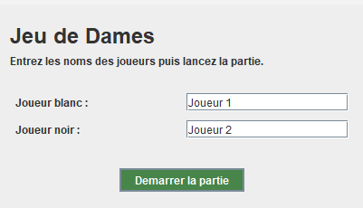
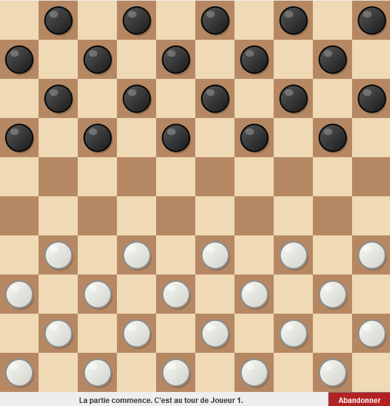
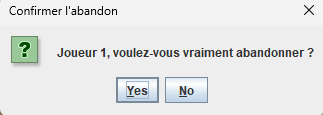

# Checkers-Lite by LitePlay - Projet Java POO

## 👥 Présentation de l'équipe
Ce projet a été réalisé dans le cadre du module de Programmation Orientée Objet par :
*   **Oscar** (developpement du modèle & GUI)
*   **Florent** (développement du modèle et documentation)

## 📝 Description du Projet
Développement d'une application de **Jeu de Dames classique** (variante 10x10) entièrement codée en Java. L'application permet à deux joueurs de s'affronter sur le même ordinateur via une interface graphique fluide. 

Le projet respecte l'architecture **MVC (Modèle-Vue-Contrôleur)** pour séparer la logique métier (calcul des coups, règles) de l'affichage visuel.

## 🏢 Contexte marketing
Dans un monde où le divertissement dépend de plus en plus du Cloud, nous avons développé un moteur de jeu de dames robuste et autonome. Conçu pour être intégré dans des systèmes embarqués ou des environnements à connectivité limitée, notre solution mise sur la sobriété technique et la fluidité de l'expérience utilisateur locale. 
Aucune donnée collectée, légèreté garantie. Ce sont les valeurs de notre entreprise LitePlay.


### Fonctionnalités principales :
*   **Règles officielles :** Déplacements diagonaux, captures obligatoires, rafles (captures multiples) et promotion des pions en Dames.
*   **Interface Graphique (GUI) :** Menu d'accueil personnalisé, plateau interactif et retour visuel sur la sélection.
*   **Gestion des Tours :** Alternance automatique entre les joueurs Blancs et Noirs.
*   **Historique des coups :** Suivi en temps réel des actions effectuées durant la partie (implémenté via `ArrayList`).
*   **Sécurité :** Validation rigoureuse de chaque mouvement pour empêcher les triches ou erreurs de manipulation.

## 🖥️ Choix de l'Interface Graphique (Veille Numérique)
Après une phase de veille technologique comparant les bibliothèques Java (Swing, JavaFX, et Compose for Desktop), notre choix s'est porté sur **Swing**.

**Justification technique :**
1.  **Stabilité et Compatibilité :** Swing est intégré nativement au JDK, ce qui simplifie le déploiement sans dépendances externes complexes.
2.  **Légèreté :** Pour un jeu de plateau en 2D, Swing offre des performances largement suffisantes sans la lourdeur d'un moteur graphique moderne.
3.  **Documentation :** Étant une solution mature, elle dispose d'une documentation exhaustive et de nombreux retours d'expérience, ce qui est idéal pour maîtriser la gestion des événements (ActionListeners, MouseEvents) dans un cadre pédagogique.
4.  **Pédagogie :** Ce choix nous permet de nous concentrer sur la logique POO pure et la gestion du thread graphique (`SwingUtilities.invokeLater`).

## 🏗️ Architecture Technique
Le projet est structuré autour des classes suivantes :
*   **`Jeu`** : Le chef d'orchestre qui gère l'état de la partie, les tours et les conditions de victoire.
*   **`Plateau`** : Grille de 10x10 gérant le placement des cases et l'initialisation.
*   **`Piece` (Abstract)** : Classe mère définissant les propriétés communes (couleur, position).
*   **`Pion` / `Dame`** : Sous-classes gérant les spécificités de déplacement et de capture via le polymorphisme.
*   **`Case`** : Représentation d'une cellule du damier.
*   **`FenetreJeu` / `FenetreMenu`** : Classes de vue gérant l'interaction utilisateur.

## 🚀 Installation et Lancement

### Prérequis
*   **Java JDK 17** ou version supérieure.
*   Un IDE (IntelliJ IDEA, Eclipse, VS Code) ou le terminal.

### Compilation et Exécution via Terminal
1.  Clonez le dépôt :
    ```bash
    git clone https://github.com/votre-lien-projet.git
    cd Projet_Java
    ```
2.  Compilez les fichiers sources :
    ```bash
    javac -d bin src/model/*.java src/view/*.java src/Main.java
    ```
3.  Lancez le jeu :
    ```bash
    java -cp bin Main
    ```

## 📸 Aperçu
Voici quelques captures d'écran de l'application :







---
